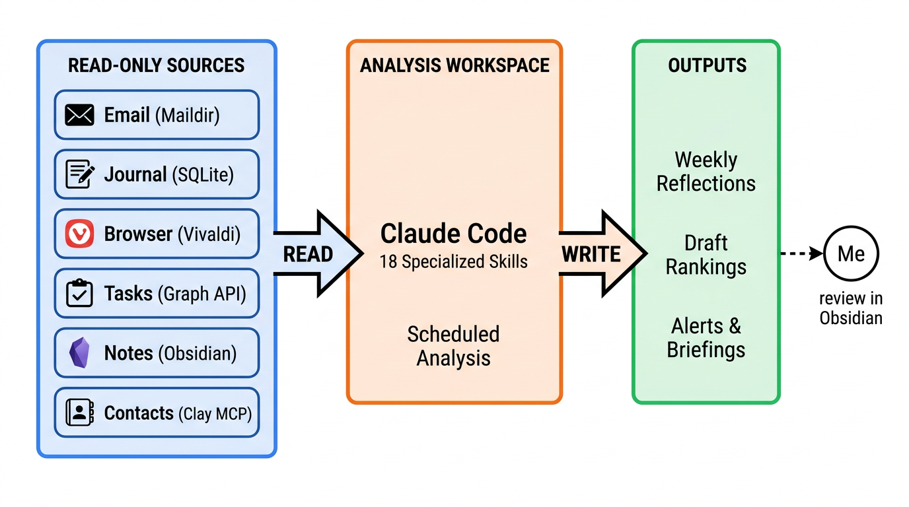

<p align="center">
  
</p>

<h1 align="center">Personal Intelligence Kit</h1>

<p align="center">
  A read-only AI system that watches your digital exhaust and tells you what the engine is actually doing.
</p>

<p align="center">
  <a href="https://copier.readthedocs.io">copier template</a> &middot;
  powered by <a href="https://claude.com/claude-code">Claude Code</a> &middot;
  MIT license
</p>

---

Every email you send, tab you open, task you create and abandon, journal entry you write — that's the **exhaust** from your thinking. Individually, each source is noise. Analyzed together, they reveal the engine.

Personal Intelligence Kit scaffolds a local vault that ingests your data sources, normalizes them into SQLite, and runs cross-source analysis skills via Claude Code. It **never writes back** to your primary data. All output lands in a separate directory for you to review.

<p align="center">
  
</p>

## What the Exhaust Reveals

| Pattern | Sources Crossed | Example |
|---------|----------------|---------|
| **Intention-action gaps** | journal + tasks + notes | "You journaled about writing that blog post three times. You haven't opened the draft once." |
| **Attention drift** | browser + tasks + git | "Your commits shifted from project A to project B mid-week. Project A's deadline is Friday." |
| **Relationship decay** | email + contacts + journal | "You haven't emailed this collaborator in 6 weeks. Last time, you said you'd follow up." |
| **Topic convergence** | browser + notes + journal | "Three sources mention eval frameworks this week — and two people in your network work on this." |

No single source tells you any of this. The cross-source signal is the product.

## What You Get

A generated vault with:

```
my-vault/
├── CLAUDE.md              # System prompt — turns Claude Code into a personal intelligence agent
├── vault.toml             # Runtime config — single source of truth for sources & paths
├── .claude/skills/        # Analysis & ingest skills
│   ├── weekly-reflection/ # Qualitative narrative from all sources (LLM-powered)
│   ├── cross-source-queries/ # Intention gaps, commitment tracking, convergence
│   ├── data-sync/         # Parallel sync orchestrator
│   ├── email-ingest/      # mbsync + notmuch
│   ├── browser-ingest/    # Chromium history & session state
│   ├── journal-ingest/    # Rosebud / Day One / markdown
│   ├── tasks-import/      # Todoist / Microsoft To-Do / Things 3
│   ├── git-stats/         # Cross-repo commit tracking
│   ├── draft-coach/       # Socratic writing assistance
│   └── stale-drafts/      # Draft queue ranking
├── output/                # All AI-generated deliverables land here
├── data/                  # Normalized SQLite databases
├── config/                # launchd / cron templates for scheduled runs
└── logs/activity.md       # Append-only audit trail
```

Skills read `vault.toml` and skip disabled sources gracefully. Enable what you use, ignore the rest.

## Quickstart

```bash
# Install prerequisites
brew install uv
uv tool install copier

# Generate your vault
copier copy gh:shippy/personal-intelligence-kit ~/my-vault
cd ~/my-vault

# Start Claude Code
claude
```

Then ask: *"Read vault.toml and list my enabled data sources."*

Copier will prompt you to choose which sources to enable, where your data lives, and which task manager you use. Everything is reconfigurable after generation via `vault.toml`.

## Data Sources

| Source | Integration | Auth |
|--------|------------|------|
| **Email** | mbsync (IMAP) + notmuch indexing | IMAP credentials in `~/.mbsyncrc` |
| **Journal** | Rosebud, Day One, or plain markdown | File path |
| **Browser** | Vivaldi, Chrome, Brave, Edge (auto-detected) | Full Disk Access (macOS) |
| **Tasks** | Microsoft To-Do (Graph API), Todoist, Things 3 | Device code flow / API token / local DB |
| **Notes** | Obsidian, Logseq, or plain markdown | File path (read-only) |
| **Git** | Commit stats across repos with co-author detection | Local repos |
| **Contacts** | Clay.earth via MCP | API key |

## Design Principles

**Read-only against your real data.** The vault never writes to your notes, email, tasks, or any primary source. This isn't a limitation — it's the point. Read-only means the AI analyzes authentic traces of your cognition, not its own output. And when it's wrong, the cost is zero: you just ignore it.

**Claude Code is the runtime.** No Python CLI to install, no web server, no daemon. Skills are Python scripts that Claude Code runs on demand or on a schedule. `vault.toml` is the config. That's the whole architecture.

**Skills, not one monolithic prompt.** Each analysis capability is a separate skill with its own `SKILL.md`, dependencies, and data contracts. They compose through normalized SQLite databases — ingest skills write to them, analysis skills read from them.

**Local-first, cloud-analyzed.** Your data stays on your machine. Analysis goes through the Anthropic API. This is a deliberate trade-off: cross-source LLM synthesis requires a capable model. As local models improve, the architecture supports swapping in a local provider.

## Updating

Pull template improvements into an existing vault:

```bash
cd ~/my-vault
copier update --vcs-ref=v0.4.4
```

This re-renders templates and merges changes. Your `output/`, `data/`, `logs/`, and `.env` are preserved across updates.

## License

MIT — see [LICENSE](LICENSE).

## Credits

By [Simon Podhajsky](https://simon.podhajsky.net). The "cognitive exhaust fumes" framing comes from a [talk at ai.engineer/europe 2026](https://slides.podhajsky.net/read-only-ai).
